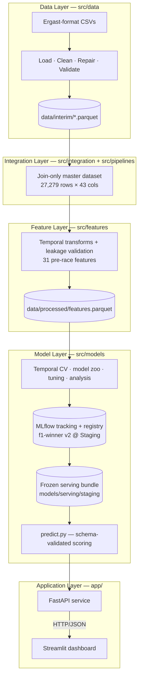

# 🏎️ F1 Race Winner Prediction

**A production-style Machine Learning, MLOps, and Data Engineering platform that predicts Formula 1 race winners from pre-race information.**

[](https://github.com/Aditya5309/f1-race-intelligence-platform/actions/workflows/ci.yml)


**Contents:**
[Project Overview](#1-project-overview) ·
[Key Features](#2-key-features) ·
[Dashboard Overview](#3-dashboard-overview) ·
[Architecture](#4-architecture) ·
[Technology Stack](#5-technology-stack) ·
[Repository Structure](#6-repository-structure) ·
[Data & ML Pipeline](#7-data--ml-pipeline) ·
[Installation & Quick Start](#8-installation--quick-start) ·
[API Usage](#9-api-usage) ·
[Model Performance](#10-model-performance) ·
[Testing & Code Quality](#11-testing--code-quality) ·
[Continuous Integration](#12-continuous-integration) ·
[Screenshots](#13-screenshots) ·
[Documentation](#14-documentation) ·
[Roadmap](#15-roadmap) ·
[Future Work](#16-future-work) ·
[Repository Highlights](#17-repository-highlights) ·
[License](#18-license) ·
[Acknowledgements](#19-acknowledgements)

---

## 1. Project Overview

**What it is.** An end-to-end ML system that scores every driver entered in a Formula 1 Grand Prix using only information available *before* lights out (grid position, qualifying results, rolling form, lagged championship standings) and ranks them by win probability. One binary classification row per `(race, driver)`; the highest-probability driver is the predicted winner.

**Why it exists.** The goal is not just a model — it is a portfolio-quality demonstration of how a real ML product is engineered: layered data pipelines with validation and repair, leakage-audited temporal feature engineering, disciplined model selection with a guarded hold-out, probability calibration, experiment tracking and a model registry, a typed inference API, and a dashboard that consumes it like a real client.

**Current capabilities (implemented and tested):**

- Reproducible batch pipeline from raw Ergast-format CSVs to a 27,279-row feature store (31 leakage-controlled features).
- Five-candidate model zoo compared under season-grouped temporal cross-validation; final model calibrated and registered in MLflow.
- Historical race predictions (through 2024) served via FastAPI and a five-page Streamlit dashboard.
- 398 automated tests (95% measured `src/` coverage), including one explicit leakage test per identified risk.
- GitHub Actions CI running the full quality gate on every push and pull request.

> This is currently **local, trusted-use software**: no authentication, containers, automated ingestion, or monitoring yet — those are roadmap items (see [Roadmap](#15-roadmap)).

---

## 2. Key Features

| Area | What is implemented |
|---|---|
| **End-to-end ML pipeline** | Raw CSV → cleaning/repair/validation → master dataset → temporal features → training/calibration → registry → API → dashboard, each as an independently tested layer |
| **Data engineering** | Central `\N`-null handling, dtype enforcement, deterministic repair of real data defects (duplicate entries, null positions), custom validators with `ValidationResult` reporting, idempotent interim parquet builds |
| **Feature engineering** | 31 pre-race features across 5 modular groups (qualifying, driver form, constructor form, circuit history, lagged standings); import-time assertion that no post-race column can ever become a feature |
| **Model training & evaluation** | Pole-sitter baseline + LogReg + Random Forest + XGBoost + LightGBM; season-grouped expanding-window CV; per-race top-1 / top-3 / MRR metrics; one-time guarded final test; SHAP + permutation-importance analysis |
| **Probability calibration** | Out-of-fold isotonic calibration fit strictly on training-fold predictions (validation ECE 0.153 → 0.012) |
| **MLflow tracking & registry** | Every experiment logged with data fingerprints; registered model `f1-winner` with alias-based staging; artifacts store the trained schema (`ColumnGuard`) and re-validate it at inference |
| **Frozen serving bundle** | Registration exports a plain local bundle (`models/serving/<alias>/`) that FastAPI loads directly — no live MLflow tracking server, SQLite registry, or `mlruns/` needed at request time |
| **FastAPI inference API** | `GET /health`, `/model`, `/races`, `/predictions/{race_id}`; degraded-mode startup; FIFO prediction cache keyed by `(model_version, race_id)`; forward-holdout guard (409 for years > 2024) |
| **Streamlit dashboard** | Five fan-first pages (see [Dashboard Overview](#3-dashboard-overview)); predictions consumed from the API over HTTP only — zero imports from model code |
| **Continuous integration** | GitHub Actions: Ruff lint + 398-test suite + coverage report + synthetic end-to-end smoke on every push and pull request — currently green (see [Continuous Integration](#12-continuous-integration)) |
| **Automated testing** | 398 tests across 17 modules covering loading, cleaning, interim repairs, integration, features (leakage suite), splits, training, calibration, prediction, serving-bundle export/load, analysis, CLI entry points, and the API — 95% measured `src/` coverage |

---

## 3. Dashboard Overview

The dashboard is designed as a Formula 1 analytics product first: four user-facing pages answer *who wins, why, and what's trending*, while all ML internals are confined to one clearly-labeled advanced page.

| Page | What it shows |
|---|---|
| 🏠 **Dashboard** | System status cards (model stage, API health, latest version, supported seasons) and headline evaluation metrics |
| 🏎 **Race Center** | Grand-Prix-name header, hero favorite card with confidence level, top-5 contender cards (grid/qualifying/trend), "why did the model choose this driver?" factor badges, race facts, constructor-colored full-field chart |
| 👤 **Driver Explorer** | Driver profile with championship position; wins/podiums/poles/points/average-qualifying/average-finish tiles; qualifying, finishing, points, and win-share trend charts |
| 📊 **Season Analytics** | Championship standings, most-predicted winners, most surprising races, win-share distribution, model accuracy round by round |
| 🤖 **Model Insights** | *Advanced:* model card, validation results, model comparison, SHAP/importance/calibration artifacts, feature classification |

Predictions come exclusively from the FastAPI service over HTTP; display metadata (Grand Prix names, grids, standings) is read from local CSVs in read-only form and degrades gracefully when absent.

---

## 4. Architecture



| Layer | Responsibility |
|---|---|
| `src/data` | Load raw CSVs, enforce types, derive result status, repair known defects, validate, publish interim parquet |
| `src/integration` + `src/pipelines` | Pure key-joins of cleaned sources into one `(raceId, driverId)`-grain master table — no feature logic |
| `src/features` | All temporal feature construction: shift-before-roll windows, race-grain constructor aggregation (no teammate leakage), prior-visits-only circuit history, standings lagged to the previous round |
| `src/models` | Temporal splits, model zoo, training/tuning, evaluation, SHAP analysis, OOF isotonic calibration, MLflow registration, and the single model-agnostic inference contract |
| `app/` | Thin serving adapter: FastAPI translates HTTP into `predict.py` calls, which load a frozen serving bundle — no live MLflow tracking server or registry needed at request time (Decision 026/027); five Streamlit views plus shared `components`/`charts`/`metadata` modules consume the API over HTTP for all predictions |

**Temporal discipline** is the platform's #1 correctness constraint: strictly year-based splits (train 2010–2021, validation 2022–2023, one-shot test 2024), 2025–2026 held out entirely, and every feature computable at the moment the starting grid is known.

---

## 5. Technology Stack

| Concern | Technology |
|---|---|
| Data processing | pandas, NumPy, PyArrow / Parquet |
| Modeling | scikit-learn, XGBoost, LightGBM |
| Experiment tracking / registry | MLflow (SQLite backend) |
| Explainability | SHAP, per-race permutation importance |
| API | FastAPI, Uvicorn, Pydantic |
| Dashboard | Streamlit, Plotly, httpx |
| Configuration | pydantic-settings (`F1_` env prefix) |
| Testing | pytest + pytest-cov (398 tests, 95% `src/` coverage) |
| Linting | Ruff (configured in `pyproject.toml`; lint-only, formatter not adopted) |
| Continuous integration | GitHub Actions (Ubuntu, Python 3.11) |

---

## 6. Repository Structure

```text
.github/workflows/   ci.yml — GitHub Actions CI (lint, tests, coverage, smoke)
app/                 FastAPI service, settings, five-page Streamlit dashboard
                     (views + components/charts/metadata modules)
data/                Raw / interim / processed datasets (gitignored)
docs/                User guide, API reference, EDA images, CI screenshot
notebooks/           Exploratory analysis only — no business logic
reports/             Design docs, model-selection evidence, SHAP artifacts
                     (gitignored — local only, not in a fresh clone)
scripts/             dev.py — single-command local dev launcher (API + dashboard)
                     smoke.py — end-to-end smoke test on a synthetic stack
src/data/            Loading, cleaning, validation, interim parquet builders
src/integration/     Join-only master dataset builder
src/pipelines/       Dataset build orchestration
src/features/        Modular feature groups + pipeline + feature metadata
src/models/          Splits, eras, registry, training, evaluation, analysis,
                     calibration, prediction, frozen serving-bundle export/load
tests/               398 pytest tests mirroring every implemented layer
Makefile             make lint / test / coverage / quality / smoke / all
pyproject.toml       PEP 621 packaging — version, dependencies, Ruff config
requirements.txt     Installer shim (-e .[dev]); pins live in pyproject.toml
```

---

## 7. Data & ML Pipeline

| Stage | Module | Output artifact |
|---|---|---|
| Load · clean · repair · validate | `src/data` | `data/interim/*.parquet` |
| Master join (integration only) | `src/integration` + `src/pipelines` | `master_dataset.parquet` (27,279 rows × 43 cols) |
| Temporal feature engineering | `src/features` | `features.parquet` (31 pre-race features) |
| Train · tune · calibrate · register | `src/models/train.py` + `calibration.py` | MLflow registry — `f1-winner` v2 @ `Staging` |
| Export frozen serving bundle (Decision 026/027) | `src/models/serving_bundle.py` | `models/serving/staging/` — model + manifest, no live MLflow needed to serve |
| Score | `src/models/predict.py` | Per-race normalized win probabilities |

Every stage enforces temporal discipline: rolling windows shift before they roll, championship standings are lagged to the previous round, circuit history uses prior visits only, and fitted preprocessing state is learned from the training window alone. The 2024 test season was scored exactly once behind a guarded flag, and 2025–2026 data is excluded from every split and from serving by default.

---

## 8. Installation & Quick Start

**Prerequisites:** Python ≥ 3.11 and the Ergast-format CSV files in `data/` (data is not committed to git).

```bash
# 1. Install
pip install -r requirements.txt
pip install -e .

# 2. Quality checks: tests + lint (both expected clean)
pytest tests/
python -m ruff check .

# 2b. End-to-end smoke test — synthetic stack, works BEFORE data/ exists
python scripts/smoke.py
# (with make: `make quality` / `make smoke` / `make all`)

# 3. Build the datasets (idempotent; run in order)
python -m src.data.build_interim --target all   # interim parquet
python -m src.pipelines.build_dataset           # master dataset
python -m src.features.pipeline                 # feature store

# 4. Train and inspect models
python -m src.models.train                      # stage 1: full model zoo
python -m src.models.train --model logreg --tune  # stage 2: randomized search
mlflow ui                                       # browse experiments

# 5. Score a race from the registered model
python -m src.models.predict --race-id 1120

# 6. Serve — one command, starts the API if needed and waits for it to be
#    healthy before launching the dashboard (dev tooling only, Decision 025
#    — production still runs the two services independently)
python scripts/dev.py                           # UI → http://localhost:8501
# (with make: `make dev`)

# ...or the two processes separately, as before:
uvicorn app.api:app                             # API  → http://localhost:8000
streamlit run app/dashboard.py                  # UI   → http://localhost:8501
# If the console scripts aren't on your PATH, the module forms always work:
#   python -m uvicorn app.api:app
#   python -m streamlit run app/dashboard.py
```

---

## 9. API Usage

| Method | Path | Purpose |
|---|---|---|
| GET | `/health` | Liveness plus serving-model identity (reports degraded mode instead of crashing) |
| GET | `/model` | Full metadata of the registered serving model |
| GET | `/races?year=` | Races available for scoring (seasons through 2024) |
| GET | `/predictions/{race_id}` | Win probabilities for the full field of one historical race |
| GET | `/debug/features/{race_id}` | Exact feature vectors fed to the model — disabled by default (`F1_DEBUG_ENDPOINTS=true`) |
| POST | `/predict` | Reserved for upcoming-race scoring — intentional `501` until the pre-race feature pipeline exists |

Requests for seasons after 2024 return `409` (forward-holdout guard). Prediction responses are cached FIFO, keyed by `(model_version, race_id)`.

```bash
curl http://localhost:8000/predictions/1120
```

Abridged response (full contract in the API reference below):

```json
{
  "race_id": 1120,
  "year": 2023,
  "round": 22,
  "model": { "name": "f1-winner", "version": "2", "alias": "Staging" },
  "predictions": [
    {
      "driver_name": "Max Verstappen",
      "constructor_name": "Red Bull",
      "predicted_rank": 1,
      "win_probability": 0.7634
    }
  ],
  "model_top1_hit": true
}
```

Full request/response contracts: [docs/api_reference.md](docs/api_reference.md).

---

## 10. Model Performance

The registered serving model is **`f1-winner` v2 @ `Staging`**: a tuned logistic regression (`C ≈ 0.0165`, class-weighted) wrapped in out-of-fold isotonic calibration. The `Production` alias is intentionally unset pending a deliberate promotion decision.

| Metric | Validation (2022–2023, 44 races) | Final test (2024, 24 races) |
|---|---|---|
| Top-1 accuracy (winner picked) | **68.2%** (pole baseline: 54.5%) | 45.8% (equal to pole baseline) |
| Top-3 winner recall | **88.6%** | 75.0% |
| Winner MRR | — | 0.643 |

**Calibration impact** (validation): ECE 0.153 → **0.012**, log-loss 0.268 → **0.088**, Brier 0.088 → 0.026, with top-1 accuracy unchanged.

**Honest limitation, stated by design:** the model's top-1 edge over the pole-sitter baseline is concentrated in dominance seasons (2023: 90.9% vs 63.6%). In competitive seasons it reaches pole-baseline parity on top-1 while still adding top-3 recall and far better probability quality. The 2024 test set was evaluated exactly once and is not reused for tuning.

---

## 11. Testing & Code Quality

- **398 tests across 17 modules** — loading, cleaning, interim repairs, integration, features, splits, eras, training, calibration, prediction, serving-bundle export/load, analysis, CLI entry points, and the API — including **one explicit leakage test per identified risk**.
- **Coverage:** 95% measured on `src/` (target ≥ 80%); `app/api.py` at 98%. Streamlit views are intentionally untested at unit level (presentation-only HTTP consumers).
- **Linting:** Ruff, zero findings (`python -m ruff check .`); rule set and reason-commented exemptions live in `pyproject.toml`.
- **Smoke test:** `python scripts/smoke.py` — a six-step synthetic end-to-end check (config → MLflow train/register + bundle export → frozen-bundle load → prediction contract → in-process FastAPI health + prediction → headless dashboard run via Streamlit's `AppTest`). Needs no `data/`, no ports, no services; ~20 seconds.
- **Hermetic tests:** MLflow tracking artifacts and frozen serving bundles are both written into per-test temp directories (`tests/conftest.py`; explicit `bundle_root` in every `register_model()` call), so the full suite and smoke test write zero files into the checkout — verified by temporarily renaming the real MLflow store and local engineering-notes directories out of the way and re-running everything clean.
- Shortcuts: `make quality` (lint + tests) and `make smoke`.

---

## 12. Continuous Integration

Every push and pull request runs the full quality gate on GitHub Actions (`.github/workflows/ci.yml`, Ubuntu, Python 3.11):

1. `pip install -e .[dev]`
2. `python -m ruff check .`
3. `pytest tests/` with coverage (`coverage.xml` uploaded as a build artifact)
4. `python scripts/smoke.py`

On a clean runner the 4 tests that need the local `data/` files skip themselves — **394 passed / 4 skipped is the healthy CI baseline**. Coverage is reported, not yet gated.


---

## 13. Screenshots

| Artifact | Preview |
|---|---|
| Grid position vs win rate (EDA) |  |
| CI pipeline green | See [Continuous Integration](#12-continuous-integration) |

_Dashboard screenshots are queued for the README-finalization pass._

---

## 14. Documentation

| Document | Purpose |
|---|---|
| [docs/user_guide.md](docs/user_guide.md) | Running and using the platform *(being refreshed for the five-page dashboard)* |
| [docs/api_reference.md](docs/api_reference.md) | Endpoint contracts and configuration |

Detailed design documents, EDA findings, and model-selection evidence live in the local-only `reports/` directory (not distributed with the repository). The project also maintains an internal, append-only architectural decision log (28 entries) and an F1 domain-knowledge reference as local engineering notes — not part of this repository.

---

## 15. Roadmap

### Completed

- [x] **Phase 0 — Setup:** production-oriented package layout and tooling
- [x] **Phase 1 — Data:** loading, cleaning, repair, validation, interim outputs
- [x] **Phase 2 — EDA:** structural analysis and temporal split strategy
- [x] **Phase 3 — Features:** master dataset + 31-feature leakage-safe matrix
- [x] **Phase 4 — Models:** zoo, temporal CV, tuning, calibration, MLflow registry, inference layer
- [x] **Phase 5 — Application:** FastAPI, Streamlit dashboard, configuration, user docs
- [x] **Quality baseline:** 95% measured `src/` coverage, Ruff clean, synthetic smoke test, Makefile
- [x] **Continuous integration:** GitHub Actions running lint + tests + coverage + smoke — live and green
- [x] **Dashboard redesign:** five-page fan-first analytics UI with an advanced Model Insights page
- [x] **Training/serving decoupling (Decision 026/027):** the API loads a frozen serving bundle (`models/serving/`) — no live MLflow tracking server, SQLite registry, or `mlruns/` directory required at request time; training/tracking/registration are unchanged
- [x] **Repository self-containment (Decision 028):** no tracked file references this project's private local engineering-notes directories anymore — verified by temporarily removing them and re-running the full test/lint/smoke gate clean

### Current

- [ ] **Docker:** containerized API and dashboard as separate services (artifact strategy resolved — bake the same frozen bundle into the image)

### Planned

- [ ] **Deployment gate:** authentication, CORS/trusted-host, secrets handling, production ASGI topology
- [ ] **ETL & incremental sync:** maintained upstream data source, idempotent ingestion, atomic dataset publication
- [ ] **Upcoming-race prediction:** pre-race feature materialization and the reserved `POST /predict` endpoint (currently an intentional `501` stub)
- [ ] **Monitoring:** data-quality, drift, latency, and model-performance tracking
- [ ] **Automated retraining:** scheduled retraining with approval, promotion, and rollback controls

---

## 16. Future Work

Beyond the roadmap milestones, measured candidates for the next model iteration include: teammate-delta features (the cleanest car-controlled driver-skill signal in this schema), a circuit pole-conversion-rate feature, grid-vs-qualifying penalty deltas, sprint-weekend features (format-aware), constructor lineage mapping across rebrands, era-aware training weights, weather-forecast integration via FastF1, and a learning-to-rank reformulation. Each requires a leakage review against the documented domain rules before implementation.

---

## 17. Repository Highlights

Pointers to the most interesting engineering, for reviewers:

- **Leakage test suite** — `tests/test_features.py` maps one explicit test to every documented temporal-leakage risk (post-race columns, standings lag, teammate same-race exclusion, prior-visits-only circuit history).
- **Schema-guarded inference** — every fitted pipeline starts with a `ColumnGuard` that records feature names/order/dtypes at training time and re-validates them at prediction time, so old artifacts always validate against what they were trained on.
- **Calibration done strictly out-of-fold** — `CalibratedModel` wraps the base pipeline with an isotonic calibrator fit only on out-of-fold training predictions; a naive refit is deliberately impossible (`.fit()` raises).
- **Regulation-aware evaluation** — `src/models/eras.py` + `SplitStrategy` presets encode F1 regulation eras as a code-level domain model with import-time contiguity asserts.
- **Hermetic MLflow testing** — `tests/conftest.py` pins experiment artifact roots into temp directories, keeping 398 tests and the smoke script from writing a single file into the checkout.
- **Headless dashboard verification** — the smoke test runs the real Streamlit entry point via `AppTest`, catching failures that only occur inside a live script context (this caught a real navigation bug).
- **Decision discipline** — 28 append-only architectural decision records; superseding requires a new entry, never an edit.

---

## 18. License

This project is licensed under the [MIT License](LICENSE). The underlying historical data follows the Ergast schema and is not distributed with this repository; obtain it separately and note its own terms of use.

---

## 19. Acknowledgements

Historical race data follows the schema of the [Ergast Motor Racing Database](http://ergast.com/mrd/) (deprecated end of 2024; community continuations exist). Formula 1 and related marks belong to their respective owners; this is an unaffiliated educational/portfolio project.

---

*Started June 2026 · Core ML Platform July 2026 · CI + five-page dashboard July 2026*
