# 🏎️ F1 Race Winner Prediction

**A production-style Machine Learning, MLOps, and Data Engineering platform that predicts Formula 1 race winners from pre-race information.**

[](https://github.com/Aditya5309/f1-race-intelligence-platform/actions/workflows/ci.yml)


**Contents:**
[Project Overview](#1-project-overview) ·
[Key Features](#2-key-features) ·
[Dashboard](#3-dashboard) ·
[Architecture](#4-architecture) ·
[Technology Stack](#5-technology-stack) ·
[Repository Structure](#6-repository-structure) ·
[Data & ML Pipeline](#7-data--ml-pipeline) ·
[Installation & Quick Start](#8-installation--quick-start) ·
[Docker](#9-docker) ·
[API Usage](#10-api-usage) ·
[Model Performance](#11-model-performance) ·
[Testing & Code Quality](#12-testing--code-quality) ·
[Continuous Integration](#13-continuous-integration) ·
[Screenshots](#14-screenshots) ·
[Documentation](#15-documentation) ·
[Project Status & Roadmap](#16-project-status--roadmap) ·
[Contributing & Security](#17-contributing--security) ·
[License](#18-license) ·
[Acknowledgements](#19-acknowledgements)

---

## 1. Project Overview

**What it is.** An end-to-end ML system that scores every driver entered in a Formula 1 Grand Prix using only information available *before* lights out (grid position, qualifying results, rolling form, lagged championship standings) and ranks them by win probability. One binary classification row per `(race, driver)`; the highest-probability driver is the predicted winner.

**Why it exists.** The goal is not just a model — it is a demonstration of how a real ML product is engineered end to end: layered data pipelines with validation and repair, leakage-audited temporal feature engineering, disciplined model selection with a guarded hold-out, probability calibration, experiment tracking and a model registry, a versioned inference API, a dashboard client, containerized deployment, and a hardened CI pipeline.

**Current capabilities:**

- Reproducible batch pipeline from raw Ergast-format CSVs to a leakage-controlled feature store covering every season back to 1950.
- A five-candidate model zoo compared under season-grouped temporal cross-validation; the final model is calibrated and registered through MLflow.
- Historical race predictions (through 2024) served via a versioned FastAPI service and an eight-page Streamlit dashboard, including an interactive grid-position simulator and a model-vs-baseline comparison view.
- **Upcoming-race prediction**: a pre-race feature-materialization pipeline scores the single next race with no result yet, reusing the same served model and feature pipeline as every historical prediction — no separate model, no third-party call at request time. See [Pre-Race Materialization](#7-data--ml-pipeline).
- 619 automated tests (95% measured `src/` coverage, enforced in CI), including one explicit leakage test per identified risk and two mandatory acceptance gates (golden-row parity, historical backtest) for the materialization pipeline.
- Docker images for both services, weekly automated data ingestion and retraining with a promotion gate, a self-healing cache-restoration fallback for the scheduled retraining workflow, and a hardened GitHub Actions pipeline (linting, secret scanning, dependency vulnerability scanning, test coverage enforcement).

> **Trust posture:** this is a public, read-only demonstration deployment. There is no authentication. Every route is `GET` except `POST /predict`, which only ever accepts an identity payload (year/round, optional entry-list override) — never feature values. See [API Usage](#10-api-usage) for the reasoning.

---

## 2. Key Features

| Area | What is implemented |
|---|---|
| **End-to-end ML pipeline** | Raw CSV → cleaning/repair/validation → master dataset → temporal features → training/calibration → registry → API → dashboard, each an independently tested layer |
| **Data engineering** | Central `\N`-null handling, dtype enforcement, deterministic repair of real data defects (duplicate entries, null positions), custom validators with structured reporting, idempotent interim parquet builds |
| **Feature engineering** | Pre-race features across five modular groups (qualifying, driver form, constructor form, circuit history, lagged standings, teammate deltas), plus experimental weather features; an import-time assertion guarantees no post-race column can ever become a feature |
| **Model training & evaluation** | Pole-sitter baseline + logistic regression + random forest + XGBoost + LightGBM; season-grouped expanding-window cross-validation; per-race top-1 / top-3 / MRR / Spearman-correlation metrics; a one-time guarded final test; SHAP and permutation-importance analysis |
| **Probability calibration** | Out-of-fold isotonic calibration fit strictly on training-fold predictions (validation ECE 0.153 → 0.012) |
| **MLflow tracking & registry** | Every experiment logged with data fingerprints; registered model `f1-winner` with alias-based staging; each artifact stores its trained schema and re-validates it at inference |
| **Frozen runtime artifacts** | Registration exports a self-contained model bundle plus a features snapshot that the API loads directly — no live MLflow tracking server or database needed at request time; the runtime artifact tree is committed to git so a fresh clone can serve real predictions immediately |
| **Versioned inference API** | FastAPI, every route under `/api/v1`, with automatic backward compatibility for the pre-versioning paths; degraded-mode startup instead of crash-looping; a FIFO prediction cache |
| **Upcoming-race prediction** | `GET /races/upcoming` (identity of the next race with no result yet) and `POST /predict` (scores it) — a Materializer builds a synthetic pre-race feature row through the same, unmodified feature pipeline, gated behind mandatory golden-row-parity and historical-backtest acceptance checks; see [docs/pre_race_materialization.md](docs/pre_race_materialization.md) |
| **Interactive "what-if" views** | A grid-position/pit-lane prediction simulator and a model-vs-pole-baseline comparison, both reusing the same scoring contract as historical predictions — no separate model needed |
| **Streamlit dashboard** | Eight pages (see [Dashboard](#3-dashboard)); predictions consumed from the API over HTTP only — the dashboard never imports the model code directly |
| **Automated data operations** | Weekly ingestion from a maintained upstream source, an atomic rebuild-and-freeze pipeline, a promotion gate that blocks any retrained candidate whose accuracy regresses versus what is currently served, and a self-healing fallback that recovers the pipeline's cached training data from a durable release asset if the GitHub Actions cache is ever evicted |
| **Containerized deployment** | Separate, minimal Docker images for the API and the dashboard, each carrying only the dependencies it actually needs at runtime; Docker Compose for local orchestration |
| **Hardened CI/CD** | GitHub Actions: secret scanning, linting, dependency vulnerability scanning, the full test suite with an enforced coverage floor, and an end-to-end smoke test on every push and pull request; automated weekly dependency-update pull requests |

---

## 3. Dashboard

The dashboard is a Formula 1 analytics product first: fan-facing pages answer *who wins, why, and what's trending*, while ML internals are confined to one clearly labeled advanced page.

| Page | What it shows |
|---|---|
| 🏠 **Dashboard** | System status (model stage, API health, supported seasons) and headline evaluation metrics |
| 🏎 **Race Center** | Grand Prix header, favorite/contender cards, "why did the model choose this driver?" factor badges, a full-field chart, an interactive grid-position simulator, and a model-vs-pole-baseline comparison; also picks and scores the single upcoming race with no result yet, with a provenance panel and completeness caveats |
| 👤 **Driver Explorer** | Driver profile, career/season tiles (wins, podiums, poles, points, average qualifying/finish), and a skill radar chart (qualifying pace, race pace, consistency) |
| ⚖️ **Compare Drivers** | Side-by-side, season-scoped comparison of two drivers with overlaid radar charts |
| 🏭 **Team** | Constructor-grain season and career view |
| 🏟 **Circuit Explorer** | One circuit's all-time history, including a rendered track-layout map where available |
| 📊 **Season Analytics** | Championship standings, most-predicted winners, most surprising races, and round-by-round model accuracy |
| 🤖 **Model Insights** | *Advanced:* model card, validation results, model comparison, SHAP/importance/calibration artifacts, and feature classification |

Display metadata (Grand Prix names, grids, standings) is read from local, read-only CSVs and degrades gracefully when absent — every prediction still comes from the API.

---

## 4. Architecture

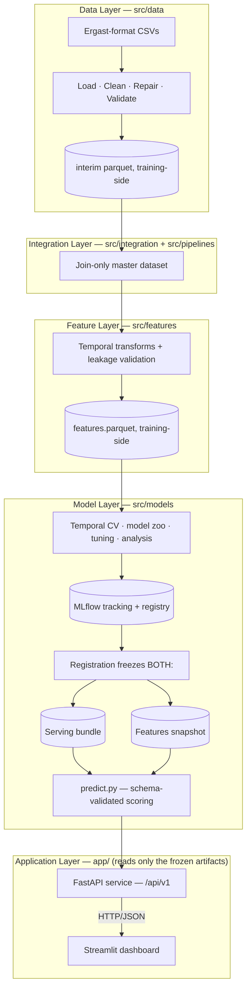

| Layer | Responsibility |
|---|---|
| `src/data` | Load raw CSVs, enforce types, derive result status, repair known defects, validate, publish interim parquet |
| `src/integration` + `src/pipelines` | Pure key-joins of cleaned sources into one `(raceId, driverId)`-grain master table — no feature logic |
| `src/features` | All temporal feature construction: shift-before-roll windows, race-grain constructor aggregation, prior-visits-only circuit history, standings lagged to the previous round |
| `src/models` | Temporal splits, model zoo, training/tuning, evaluation, SHAP analysis, out-of-fold isotonic calibration, MLflow registration, continuous accuracy monitoring for the live season, and a single model-agnostic inference contract |
| `app/` | Thin serving adapter: FastAPI translates HTTP requests into inference calls against the frozen bundle; the Streamlit dashboard consumes the API over HTTP for every prediction |

**Temporal discipline** — the platform's #1 *correctness* constraint:

- Strictly year-based splits: train 2010–2021, validation 2022–2023, one-shot test 2024.
- The 2025–2026 seasons are held out from training and tuning entirely.
- Every feature must be computable the moment the starting grid is known.

**Training vs. runtime artifacts** — the platform's #1 *deployment* constraint:

- Raw data, the MLflow tracking store, and training-only intermediates all stay out of version control.
- The deployed API and dashboard read *only* a small, committed `artifacts/` tree — the frozen model bundle plus a features snapshot.
- Registration bridges the two, freezing a training-side snapshot into that committed tree; a separate, gated promotion step is the only thing that changes what's actually served.
- **One disclosed exception:** `POST /predict` (upcoming-race prediction) additionally needs training-side data with no `artifacts/`-tree equivalent, and degrades to `503` on a deployment without it — see [docs/pre_race_materialization.md](docs/pre_race_materialization.md).

---

## 5. Technology Stack

| Concern | Technology |
|---|---|
| Data processing | pandas, NumPy, PyArrow / Parquet |
| Modeling | scikit-learn, XGBoost, LightGBM |
| Experiment tracking / registry | MLflow (SQLite backend, training-side only) |
| Explainability | SHAP, per-race permutation importance |
| API | FastAPI, Uvicorn, Pydantic |
| Dashboard | Streamlit, Plotly, httpx |
| Configuration | pydantic-settings (`F1_`-prefixed environment variables) |
| Containers | Docker, Docker Compose |
| Testing | pytest + pytest-cov (619 tests, 95% `src/` coverage) |
| Linting | Ruff (lint-only; formatter not adopted) |
| Security | gitleaks (secret scanning), pip-audit (dependency vulnerability scanning) |
| CI/CD | GitHub Actions (Ubuntu, Python 3.11), Dependabot |

---

## 6. Repository Structure

```text
src/            Data, integration, feature, and model layers (see Architecture above)
app/            FastAPI service + Streamlit dashboard (dashboard never imports src/)
tests/          619 pytest tests mirroring src/ and app/
docs/           User guide, API reference, command reference, retraining runbook
artifacts/      COMMITTED runtime tree — the only thing a deployed instance needs
scripts/        Ingestion, promotion, artifact export, local dev launcher, smoke test
docker/         Dockerfile.api, Dockerfile.dashboard
```

Full annotated directory listing, including every config file and its purpose: [CONTRIBUTING.md](CONTRIBUTING.md#repository-structure).

---

## 7. Data & ML Pipeline

Raw CSVs flow through cleaning/validation, a join-only master dataset, temporal feature engineering, and model training/calibration/registration before being frozen into the runtime artifacts the API actually serves (see [Architecture](#4-architecture) for the layer breakdown and temporal-discipline guarantees).

The served model was trained on 31 pre-race features — a curated subset of the 41-column feature pipeline, after an ablation study found one experimental group (wet-weather deltas) didn't generalize from the training window.

Full stage-by-stage breakdown (module, output artifact, and what each stage guarantees) and the commands to rebuild each one: [docs/user_guide.md](docs/user_guide.md#data--ml-pipeline).

**Pre-race materialization** extends this pipeline to score a race that hasn't happened yet: a Materializer builds one synthetic feature row per entrant through the exact same, unmodified feature-engineering code, gated behind mandatory golden-row-parity and historical-backtest acceptance checks before being wired into `POST /predict`. Full design, architecture, and known limitations (the qualifying-position-as-grid proxy, the training-side data gap): [docs/pre_race_materialization.md](docs/pre_race_materialization.md).

---

## 8. Installation & Quick Start

**Prerequisites:** Python ≥ 3.11. That's it for *serving* — the committed `artifacts/` tree ships a frozen model bundle and features snapshot, so a fresh clone can install and serve predictions immediately. The Ergast-format CSV files in `data/` (not committed to git) are only needed to rebuild the datasets or retrain from scratch.

```bash
# Install
pip install -r requirements.txt
pip install -e .

# Verify: tests + lint + end-to-end smoke test (all pass with no data/ needed)
pytest tests/
python -m ruff check .
python scripts/smoke.py

# Serve — starts the API if needed, waits for it to be healthy, then runs
# the dashboard (local development only)
python scripts/dev.py                           # UI → http://localhost:8501

# ...or the two services separately:
uvicorn app.api:app                             # API → http://localhost:8000
streamlit run app/dashboard.py                  # UI  → http://localhost:8501

# ...or in Docker instead of a local Python environment — see Docker below
docker compose up --build
```

Rebuilding the datasets, training/tuning a model, registering a candidate, and promoting it to the live serving bundle are all optional — only needed if you're changing the data pipeline or retraining. Every command for that, plus the full setup/testing/linting/release reference: [docs/commands.md](docs/commands.md).

---

## 9. Docker

Two images, `docker/Dockerfile.api` and `docker/Dockerfile.dashboard`, each a minimal `python:3.11-slim` multi-stage build carrying only the dependencies that image actually imports at runtime — the API image has no xgboost/lightgbm/shap/mlflow/streamlit; the dashboard image has no scikit-learn/scipy/mlflow. Both bake in the same committed `artifacts/` tree the non-Docker path already reads, so nothing extra needs configuring to get real predictions from the real served model.

```bash
# Build + run both services (development shape: source bind-mounted,
# live-reload, docker-compose.override.yml auto-merged by `up`)
docker compose up --build

# Production shape only — no bind mounts, no reload — name the base file
# explicitly to skip the development override
docker compose -f docker-compose.yml up --build -d

# Tear down
docker compose down
```

- Every `F1_*` setting is overridable via a `.env` file at the project root (copy `.env.example`) — Compose picks it up automatically.
- The dashboard's API URL always points at the sibling `api` Compose service by name, never an operator-supplied value; ports, log level, and cache size are all overridable.
- No persistent volumes are needed for serving — there's no database, only the baked-in `artifacts/` tree. The development override mounts it (and the source tree) read-only, purely so local edits show up without a rebuild.

**Non-Docker hosting (Render):** the API is also deployed as a native Python web service on [Render](https://render.com), without a Dockerfile. That target needs one extra build-time step to provision the training-side data `POST /predict` depends on (see [docs/pre_race_materialization.md](docs/pre_race_materialization.md)) — full setup in [docs/render_deployment.md](docs/render_deployment.md).

---

## 10. API Usage

All routes are versioned under `/api/v1`:

| Method | Path | Purpose |
|---|---|---|
| GET | `/api/v1/health` | Liveness plus serving-model identity (reports degraded mode instead of crashing) |
| GET | `/api/v1/model` | Full metadata of the registered serving model |
| GET | `/api/v1/races?year=` | Races available for scoring (every race with a completed result) |
| GET | `/api/v1/races/upcoming` | Identity of the single next race with no result yet (not a prediction) |
| GET | `/api/v1/predictions/{race_id}` | Win probabilities for the full field of one historical race |
| GET | `/api/v1/predictions/{race_id}/simulate/{driver_id}` | Prediction simulator — grid/qualifying-position "what if" |
| GET | `/api/v1/predictions/{race_id}/vs-baseline` | The model's predictions next to the pole-only baseline |
| GET | `/api/v1/debug/features/{race_id}` | Exact feature vectors fed to the model — disabled by default |
| POST | `/api/v1/predict` | Scores the upcoming race identified by `GET /races/upcoming` via the pre-race materialization pipeline; `503` if the training-side data it needs isn't available on this deployment |

Every route above is also reachable at its equivalent pre-versioning path with no `/api/v1` prefix (for example, plain `/health`) — same handler, same response — kept for backward compatibility but not listed in the interactive API docs, which only ever show the versioned contract.

Prediction responses are cached, keyed by `(model_version, race_id)`.

```bash
curl http://localhost:8000/api/v1/predictions/1120
```

Abridged response (full contract in the API reference):

```json
{
  "race_id": 1120,
  "year": 2023,
  "round": 22,
  "model": { "name": "f1-winner", "version": "4", "alias": "Staging" },
  "predictions": [
    {
      "driver_name": "Max Verstappen",
      "constructor_name": "Red Bull",
      "predicted_rank": 1,
      "win_probability": 0.7634
    }
  ],
  "model_top1_hit": true
}
```

Full request/response contracts: [docs/api_reference.md](docs/api_reference.md).
Which seasons are servable, why, and how that's distinct from the model's
evaluation holdout and upcoming-race prediction: [docs/serving_policy.md](docs/serving_policy.md).

### Security & error handling

- **CORS** is configurable via `F1_CORS_ALLOW_ORIGINS` (comma-separated origins, or `*`). The default is empty — no cross-origin browser access.
- **Every error response is logged server-side.** Unexpected server errors return a generic `{"detail": "Internal server error."}` at `500` — nothing internal is ever exposed to the client.
- **Authentication is intentionally not implemented.** This is a public, read-only demo API — every route is `GET` except `POST /predict`, which only ever accepts an identity payload (year/round, optional entry-list override), never a write of feature values — no accounts, no write path, nothing private to protect (F1 results are public record). Adding auth now would mean credential management with nothing real to guard; this would be revisited if a genuine write endpoint were ever added.

---

## 11. Model Performance

The registered serving model is **`f1-winner` v4 @ `Staging`** — a tuned logistic regression (`C ≈ 0.0165`, class-weighted) wrapped in out-of-fold isotonic calibration.

- The `Production` alias is intentionally left unset.
- The deployed API serves a version-controlled bundle committed to the repository, not a live MLflow registry lookup.
- Changing what's served always requires the gated promotion workflow below.

| Metric | Validation (2022–2023, 44 races) | Final test (2024, 24 races) |
|---|---|---|
| Top-1 accuracy (winner picked) | **68.2%** (pole baseline: 54.5%) | 45.8% (equal to pole baseline) |
| Top-3 winner recall | **86.4%** | 75.0% |
| Winner MRR | 0.793 | 0.643 |
| Spearman rank correlation | 0.597 | 0.749 |

**Notes:**

- 2024's lower top-1 accuracy reflects a substantially more competitive season than validation, not a regression — the model still beats the baseline on top-3 recall and probability quality.
- **Calibration impact** (validation): ECE 0.153 → **0.012**, log-loss 0.268 → **0.088**, Brier score 0.088 → **0.026**, top-1 accuracy unchanged — probabilities are far more trustworthy for downstream decisions, without any change to ranking performance.
- **Honest limitation, by design:** the model's top-1 edge over the pole-sitter baseline concentrates in dominance seasons (2023: 90.9% vs. 63.6%). In competitive seasons it's top-1 parity with pole, while still adding top-3 recall and materially better probability quality. The 2024 test set was scored exactly once and is never reused for tuning.
- **Live-season monitoring:** the served model is continuously scored against every newly completed race in the current regulation era — an early, honest read on live performance, separate from the fixed 2022–2024 windows above.

### Promotion & rollback

Registering a candidate in MLflow does **not**, by itself, change what is served. Only the gated promotion step (`scripts/promote_model.py`) can update the live serving bundle: it loads an already-registered candidate, validates it against held-out races, and refuses to promote if its metrics regress against the currently-served bundle's own recorded numbers.

**Rollback:** revert the commit that last changed the serving bundle — the runtime artifact tree is committed to git, so the previous bundle's exact bytes are one revert away. There is no registry-native rollback (moving an MLflow alias back to an older version): the deployed API never consults the registry at request time, so an alias change alone would not affect what's served.

---

## 12. Testing & Code Quality

- **619 tests** across the codebase — loading, cleaning, interim repairs, integration, features (including one explicit leakage test per identified risk), splits, regulation eras, training, calibration, prediction, serving-bundle export/load, analysis, ingestion, promotion, live-season monitoring, the pre-race materialization pipeline (including the mandatory golden-row-parity and historical-backtest acceptance gates), and the API.
- **Coverage:** 95% measured on `src/` (target ≥ 80%, enforced in CI); `app/api.py` at 97%. Streamlit views are intentionally untested at the unit level — they're presentation-only HTTP consumers, exercised instead by the smoke test's headless dashboard run and by manual QA. The combined `src/`+`app/` figure is reported but not gated, since it dilutes as dashboard pages are added and would measure the wrong thing.
- **Linting:** Ruff, zero findings; rule set and reason-commented exemptions live in `pyproject.toml`.
- **Smoke test:** `python scripts/smoke.py` — a synthetic end-to-end check (config → MLflow train/register + bundle export → frozen-bundle load → prediction contract → in-process FastAPI health + prediction, both versioned and legacy paths → headless dashboard run). Needs no `data/`, no ports, no external services; well under a minute.
- **Hermetic tests:** MLflow tracking artifacts and frozen serving bundles are written into per-test temporary directories, so the full suite and the smoke test write zero files into the checkout.
- Shortcuts: `make quality` (lint + tests), `make coverage-gate`, `make smoke`.

---

## 13. Continuous Integration

Every push and pull request runs the full quality gate on GitHub Actions (Ubuntu, Python 3.11):

1. **Secret scanning** (gitleaks) — blocking.
2. Install dependencies.
3. **Lint** (Ruff).
4. **Dependency vulnerability scan** (pip-audit) — report-only for now; see [docs/commands.md](docs/commands.md) for the current known-vulnerability baseline and reasoning.
5. **Test suite with coverage.**
6. **Coverage threshold** — `src/` only, enforced at 80%, reusing the same coverage data with no second test run.
7. **Smoke test.**

A passing run with the handful of real-data-only tests skipped (they need the gitignored `data/` tree, which a clean CI runner never has — see [docs/commands.md](docs/commands.md#testing) for which ones) is the healthy baseline.

**Dependency update automation:** a scheduled workflow opens weekly pull requests for Python, GitHub Actions, and Docker base-image updates — never auto-merged, reviewed like every other change.

**Scheduled data operations:** a separate weekly workflow ingests newly completed race weekends from a maintained upstream source, rebuilds every downstream artifact, and attempts a retrain — opening a pull request only when the promotion gate passes, and always opening a second, independent pull request to refresh display data regardless of whether a new model was promoted. Its cached training data self-heals from a durable GitHub Release asset if the GitHub Actions cache is ever evicted, rather than hard-failing — see [docs/retrain_workflow_setup.md](docs/retrain_workflow_setup.md).

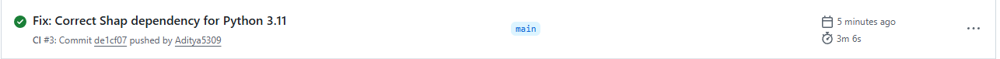

---

## 14. Screenshots

The dashboard has grown to eight pages; five are illustrated below (Compare Drivers, Team, and Circuit Explorer are not yet screenshotted).

| Page | Preview |
|---|---|
| 🏠 Dashboard | 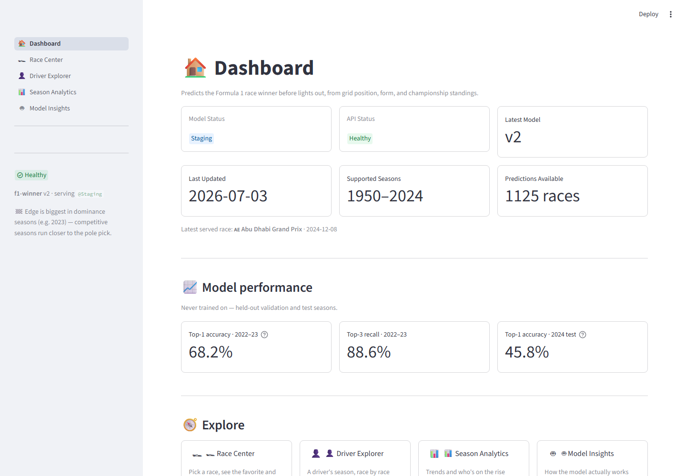 |
| 🏎 Race Center | 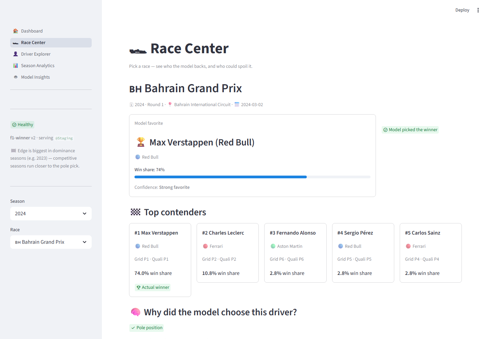 |
| 👤 Driver Explorer | 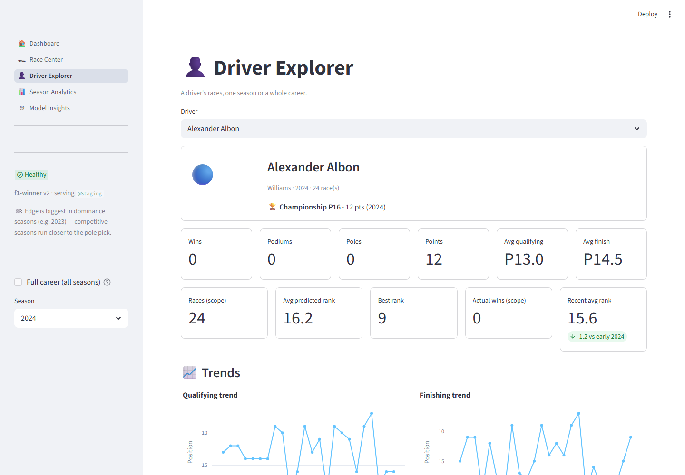 |
| 📊 Season Analytics | 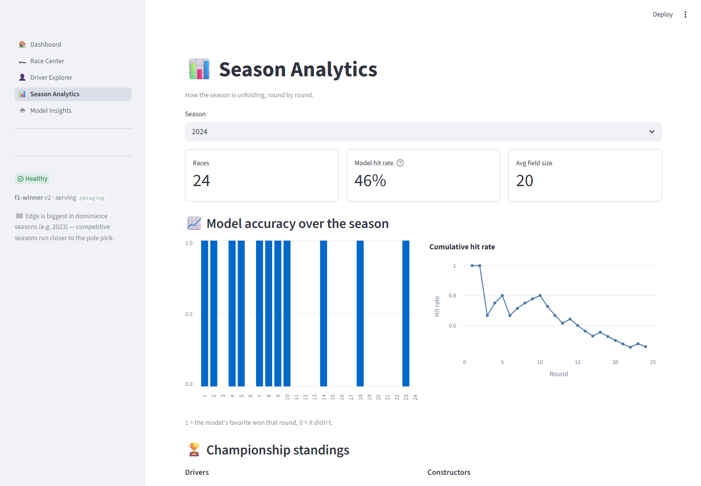 |
| 🤖 Model Insights | 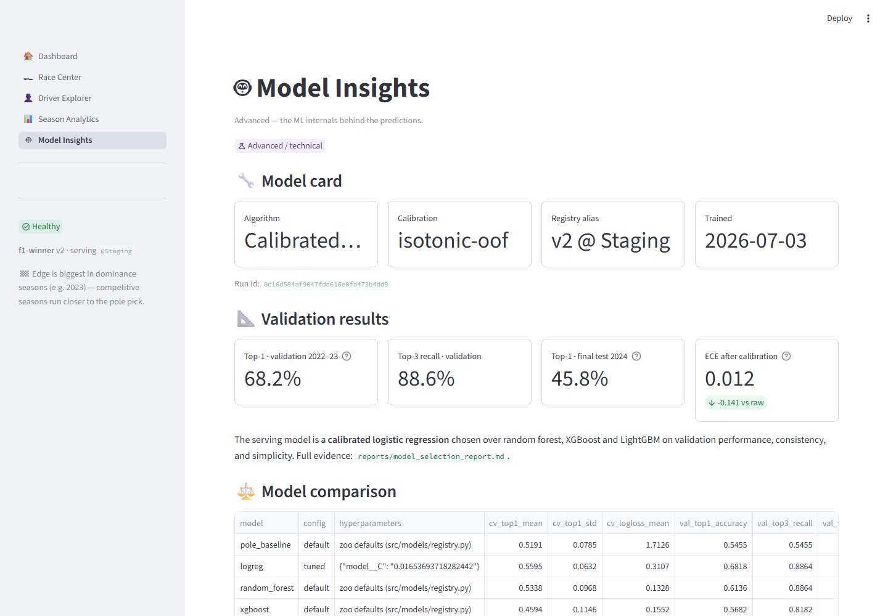 |

**EDA:**

| Artifact | Preview |
|---|---|
| Grid position vs. win rate | 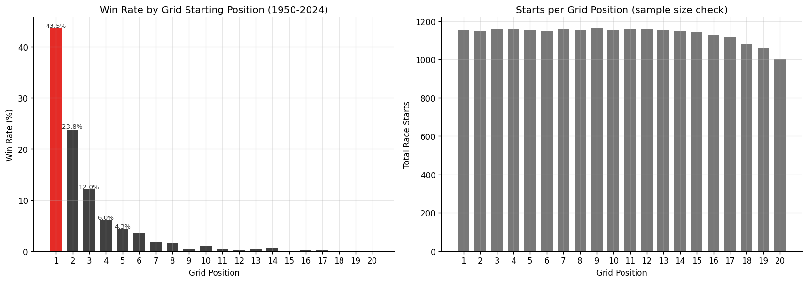 |
| Constructor dominance and championship concentration (HHI) | 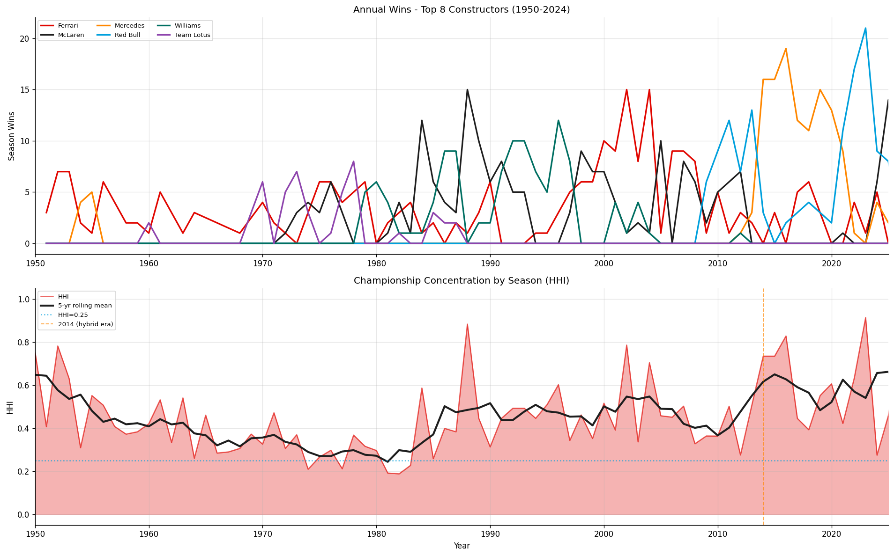 |
| Driver career win-rate distribution | 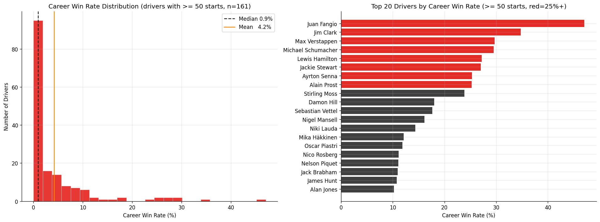 |
| Race finish/DNF status by season | 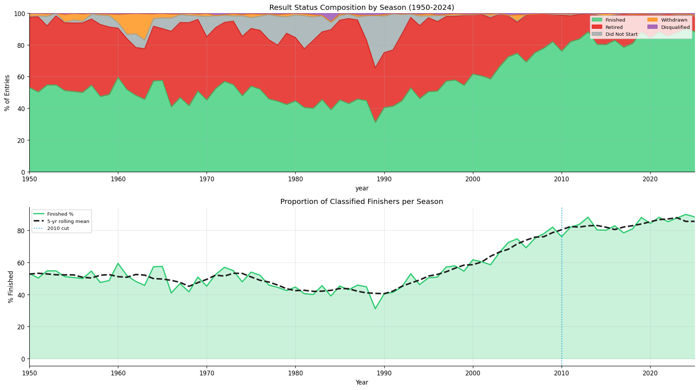 |
| Structural changes: race calendar, field size, points system, pole conversion | 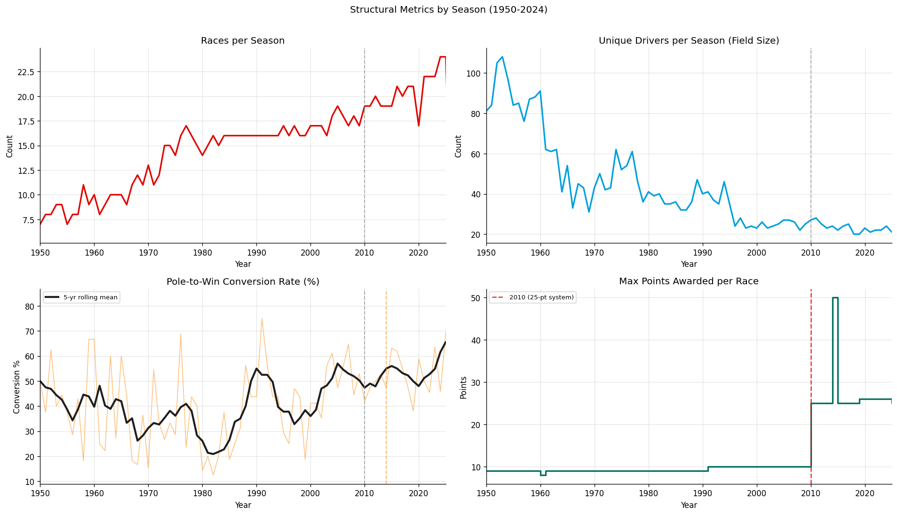 |

---

## 15. Documentation

| Document | Purpose |
|---|---|
| [docs/user_guide.md](docs/user_guide.md) | Running and using the platform, including the dashboard, Docker, and configuration |
| [docs/api_reference.md](docs/api_reference.md) | Full endpoint request/response contracts |
| [docs/pre_race_materialization.md](docs/pre_race_materialization.md) | How upcoming-race predictions are built: architecture, known limitations, acceptance gates |
| [docs/commands.md](docs/commands.md) | The complete command reference — setup, testing, linting, security scanning, Docker, Git, and release workflows |
| [docs/retrain_workflow_setup.md](docs/retrain_workflow_setup.md) | One-time setup and troubleshooting for the scheduled data-ingestion/retraining workflow |
| [docs/render_deployment.md](docs/render_deployment.md) | Render (native Python) API deployment setup, and how it provisions the data `POST /predict` needs |

---

## 16. Project Status & Roadmap

**Implemented today:** the full pipeline described above — data engineering, feature engineering, model training and calibration, a versioned and hardened serving API, an eight-page dashboard, upcoming-race prediction via the pre-race materialization pipeline, Docker images, automated weekly data ingestion with a gated retraining/promotion cycle and a self-healing cache-restoration fallback, live-season accuracy monitoring, and a CI pipeline covering linting, secret scanning, dependency vulnerability scanning, and an enforced test-coverage floor.

**Open work:**

- Fixing the specific third-party dependencies the vulnerability scan currently flags on the actually-served path (Pillow, python-multipart, Starlette); the remaining flagged packages are development-only or training-only and lower priority.
- Splitting the packaging manifest into serving/dashboard/training dependency groups, so each deployment target installs only what it needs without hand-maintained duplicate requirement files.
- Extending CI with a container build-and-push job and choosing a hosting target for the Docker images.
- A generic production authentication story, if a genuine write-capable endpoint is ever added.
- A pre-qualifying prediction regime (scoring before qualifying results exist at all) — deliberately deferred as a separate, unvalidated stretch phase; today's upcoming-race prediction requires qualifying to have run.
- Data-quality, drift, and latency monitoring beyond the accuracy tracking that already exists.
- Revisiting the wet-weather feature group for training once more seasons of live data have accumulated.

**Future model-quality candidates** (each would need its own leakage review before implementation): a circuit pole-conversion-rate feature, grid-vs-qualifying penalty deltas, sprint-weekend features, constructor-lineage mapping across rebrands, era-aware training weights, live weather-forecast integration, and a learning-to-rank reformulation of the problem.

---

## 17. Contributing & Security

- **Contributing:** see [CONTRIBUTING.md](CONTRIBUTING.md) for local setup, coding standards, and how to propose a change.
- **Security:** see [SECURITY.md](SECURITY.md) for how to report a vulnerability. Automated dependency and secret scanning run on every push (see [Continuous Integration](#13-continuous-integration)).

---

## 18. License

This project is licensed under the [MIT License](LICENSE). The underlying historical data follows the Ergast schema and is not distributed with this repository; obtain it separately and note its own terms of use.

---

## 19. Acknowledgements

Historical race data follows the schema of the [Ergast Motor Racing Database](http://ergast.com/mrd/) (deprecated end of 2024; community continuations exist). Formula 1 and related marks belong to their respective owners; this is an unaffiliated educational/portfolio project.
