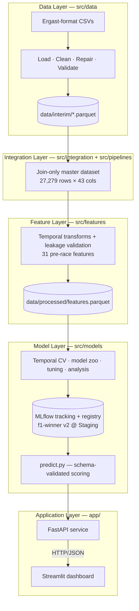

# 🏎️ F1 Race Winner Prediction

**A production-style Machine Learning, MLOps, and Data Engineering platform that predicts Formula 1 race winners from pre-race information.**


---

## 1. Project Overview

**What it is.** An end-to-end ML system that scores every driver entered in a Formula 1 Grand Prix using only information available *before* lights out (grid position, qualifying results, rolling form, lagged championship standings) and ranks them by win probability. One binary classification row per `(race, driver)`; the highest-probability driver is the predicted winner.

**Why it exists.** The goal is not just a model — it is a portfolio-quality demonstration of how a real ML product is engineered: layered data pipelines with validation and repair, leakage-audited temporal feature engineering, disciplined model selection with a guarded hold-out, probability calibration, experiment tracking and a model registry, a typed inference API, and a dashboard that consumes it like a real client.

**Current capabilities (implemented and tested):**

- Reproducible batch pipeline from raw Ergast-format CSVs to a 27,279-row feature store (31 leakage-controlled features).
- Five-candidate model zoo compared under season-grouped temporal cross-validation; final model calibrated and registered in MLflow.
- Historical race predictions (through 2024) served via FastAPI and a five-page Streamlit dashboard.
- 390 automated tests (95% measured `src/` coverage), including one explicit leakage test per identified risk.

> This is currently **local, trusted-use software**: no authentication, containers, CI/CD, automated ingestion, or monitoring yet — those are roadmap items (see [Roadmap](#9-project-roadmap)).

---

## 2. Key Features

| Area | What is implemented |
|---|---|
| **End-to-end ML pipeline** | Raw CSV → cleaning/repair/validation → master dataset → temporal features → training/calibration → registry → API → dashboard, each as an independently tested layer |
| **Data engineering** | Central `\N`-null handling, dtype enforcement, deterministic repair of real data defects (duplicate entries, null positions), custom validators with `ValidationResult` reporting, idempotent interim parquet builds |
| **Feature engineering** | 31 pre-race features across 5 modular groups (qualifying, driver form, constructor form, circuit history, lagged standings); import-time assertion that no post-race column can ever become a feature |
| **Model training & evaluation** | Pole-sitter baseline + LogReg + Random Forest + XGBoost + LightGBM; season-grouped expanding-window CV; per-race top-1 / top-3 / MRR metrics; one-time guarded final test; SHAP + permutation-importance analysis |
| **Probability calibration** | Out-of-fold isotonic calibration fit strictly on training-fold predictions (validation ECE 0.153 → 0.012) |
| **MLflow tracking & registry** | Every experiment logged with data fingerprints; registered model `f1-winner` with alias-based staging; artifacts store the trained schema (`ColumnGuard`) and re-validate it at inference |
| **FastAPI inference API** | `GET /health`, `/model`, `/races`, `/predictions/{race_id}`; degraded-mode startup; FIFO prediction cache keyed by `(model_version, race_id)`; forward-holdout guard (409 for years > 2024) |
| **Streamlit dashboard** | Dashboard, Race Center, Driver Explorer, Season Analytics, and Model Insights (advanced) pages; predictions consumed from the API over HTTP only (zero imports from model code), plus optional display metadata (GP names, grids, standings) read from local CSVs with graceful degradation |
| **Automated testing** | 390 tests across 15 modules covering loading, cleaning, interim repairs, integration, features (leakage suite), splits, training, calibration, prediction, analysis, CLI entry points, and the API — 95% measured `src/` coverage |

---

## 3. Architecture



| Layer | Responsibility |
|---|---|
| `src/data` | Load raw CSVs, enforce types, derive result status, repair known defects, validate, publish interim parquet |
| `src/integration` + `src/pipelines` | Pure key-joins of cleaned sources into one `(raceId, driverId)`-grain master table — no feature logic |
| `src/features` | All temporal feature construction: shift-before-roll windows, race-grain constructor aggregation (no teammate leakage), prior-visits-only circuit history, standings lagged to the previous round |
| `src/models` | Temporal splits, model zoo, training/tuning, evaluation, SHAP analysis, OOF isotonic calibration, MLflow registration, and the single model-agnostic inference contract |
| `app/` | Thin serving adapter: FastAPI translates HTTP into `predict.py` calls; the dashboard is a pure HTTP client of the API |

**Temporal discipline** is the platform's #1 correctness constraint: strictly year-based splits (train 2010–2021, validation 2022–2023, one-shot test 2024), 2025–2026 held out entirely, and every feature computable at the moment the starting grid is known.

---

## 4. Technology Stack

| Concern | Technology |
|---|---|
| Data processing | pandas, NumPy, PyArrow / Parquet |
| Modeling | scikit-learn, XGBoost, LightGBM |
| Experiment tracking / registry | MLflow (SQLite backend) |
| Explainability | SHAP, per-race permutation importance |
| API | FastAPI, Uvicorn, Pydantic |
| Dashboard | Streamlit, Plotly, httpx |
| Configuration | pydantic-settings (`F1_` env prefix) |
| Testing | pytest + pytest-cov (390 tests, 95% `src/` coverage) |
| Linting | Ruff (configured in `pyproject.toml`; lint-only, formatter not adopted) |

---

## 5. Repository Structure

```text
app/                 FastAPI service, settings, Streamlit entry point and pages
context/             Internal engineering memory: decisions log, domain knowledge, status
data/                Raw / interim / processed datasets (gitignored)
docs/                User guide and API reference
notebooks/           Exploratory analysis only — no business logic
reports/             Design documents, EDA figures, model selection evidence, SHAP artifacts
src/data/            Loading, cleaning, validation, interim parquet builders
src/integration/     Join-only master dataset builder
src/pipelines/       Dataset build orchestration
src/features/        Modular feature groups + pipeline + feature metadata
src/models/          Splits, registry, training, evaluation, analysis, calibration, prediction
scripts/             smoke.py — end-to-end smoke test on a synthetic stack
tests/               390 pytest tests mirroring every implemented layer
Makefile             make lint / test / coverage / quality / smoke / all
```

---

## 6. Quick Start

**Prerequisites:** Python ≥ 3.11 and the Ergast-format CSV files in `data/` (data is not committed to git).

```bash
# 1. Install
pip install -r requirements.txt
pip install -e .

# 2. Quality checks: tests + lint (both expected clean)
pytest tests/
python -m ruff check .

# 2b. End-to-end smoke test — synthetic stack, works BEFORE data/ exists
python scripts/smoke.py
# (with make: `make quality` / `make smoke` / `make all`)

# 3. Build the datasets (idempotent; run in order)
python -m src.data.build_interim --target all   # interim parquet
python -m src.pipelines.build_dataset           # master dataset
python -m src.features.pipeline                 # feature store

# 4. Train and inspect models
python -m src.models.train                      # stage 1: full model zoo
python -m src.models.train --model logreg --tune  # stage 2: randomized search
mlflow ui                                       # browse experiments

# 5. Score a race from the registered model
python -m src.models.predict --race-id 1120

# 6. Serve
uvicorn app.api:app                             # API  → http://localhost:8000
streamlit run app/dashboard.py                  # UI   → http://localhost:8501
```

---

## 7. Model Performance

The registered serving model is **`f1-winner` v2 @ `Staging`**: a tuned logistic regression (`C ≈ 0.0165`, class-weighted) wrapped in out-of-fold isotonic calibration. The `Production` alias is intentionally unset pending a deliberate promotion decision.

| Metric | Validation (2022–2023, 44 races) | Final test (2024, 24 races) |
|---|---|---|
| Top-1 accuracy (winner picked) | **68.2%** (pole baseline: 54.5%) | 45.8% (equal to pole baseline) |
| Top-3 winner recall | **88.6%** | 75.0% |
| Winner MRR | — | 0.643 |

**Calibration impact** (validation): ECE 0.153 → **0.012**, log-loss 0.268 → **0.088**, Brier 0.088 → 0.026, with top-1 accuracy unchanged.

**Honest limitation, stated by design:** the model's top-1 edge over the pole-sitter baseline is concentrated in dominance seasons (2023: 90.9% vs 63.6%). In competitive seasons it reaches pole-baseline parity on top-1 while still adding top-3 recall and far better probability quality. The 2024 test set was evaluated exactly once and is not reused for tuning.

---

## 8. Documentation

| Document | Purpose |
|---|---|
| [docs/user_guide.md](docs/user_guide.md) | Running and using the platform |
| [docs/api_reference.md](docs/api_reference.md) | Endpoint contracts and configuration |
| `reports/eda_summary.md` | Exploratory analysis findings |
| `reports/master_dataset_design.md` | Dataset grain, joins, and leakage rules |
| `reports/model_development_design.md` | Modeling contract and evaluation protocol |
| `reports/model_selection_report.md` | Model comparison evidence and final selection |
| `reports/application_design.md` | API and dashboard design |
| `context/decisions.md` | Append-only architectural decision log (21 decisions) |
| `context/domain_knowledge.md` | F1 domain reference: regulation eras, leakage vectors, data limitations |

> `reports/` and `context/` are gitignored (not shipped with a fresh clone) —
> the links above are local-filesystem paths, not live GitHub links.

---

## 9. Project Roadmap

### Completed

- [x] **Phase 0 — Setup:** production-oriented package layout and tooling
- [x] **Phase 1 — Data:** loading, cleaning, repair, validation, interim outputs
- [x] **Phase 2 — EDA:** structural analysis and temporal split strategy
- [x] **Phase 3 — Features:** master dataset + 31-feature leakage-safe matrix
- [x] **Phase 4 — Models:** zoo, temporal CV, tuning, calibration, MLflow registry, inference layer
- [x] **Phase 5 — Application:** FastAPI, Streamlit dashboard, configuration, user docs

### In progress — Quality baseline

- [x] Dedicated loader unit tests and measured ≥ 80% `src/` coverage (95% measured)
- [x] Repeatable full-system smoke-test script (`scripts/smoke.py`, synthetic stack)
- [x] Established Git workflow

### Planned

- [ ] **CI/CD:** automated tests and coverage in GitHub Actions
- [ ] **Docker:** containerized API and dashboard as separate services
- [ ] **Deployment:** authentication, secrets handling, production ASGI topology
- [ ] **ETL & incremental sync:** maintained upstream data source, idempotent ingestion, atomic dataset publication
- [ ] **Upcoming-race prediction:** pre-race feature materialization and the reserved `POST /predict` endpoint (currently an intentional `501` stub)
- [ ] **Monitoring:** data-quality, drift, latency, and model-performance tracking
- [ ] **Automated retraining:** scheduled retraining with approval, promotion, and rollback controls

---

## 10. Screenshots

_SHAP artifacts live in the gitignored `reports/phase4_analysis/` (local
filesystem only — not rendered below since it won't resolve from GitHub)._

| Artifact | Preview |
|---|---|
| Grid position vs win rate (EDA) |  |
| Streamlit dashboard | *Screenshot pending — placeholder: `docs/images/dashboard.png`* |
| MLflow experiment tracking | *Screenshot pending — placeholder: `docs/images/mlflow.png`* |
| Architecture diagram (rendered) | *See the Mermaid diagram in [Architecture](#3-architecture); image export pending: `docs/images/architecture.png`* |

---

## 11. Future Work

Beyond the roadmap milestones, measured candidates for the next model iteration include: teammate-delta features (the cleanest car-controlled driver-skill signal in this schema), a circuit pole-conversion-rate feature, grid-vs-qualifying penalty deltas, sprint-weekend features (format-aware), constructor lineage mapping across rebrands, era-aware training weights, weather-forecast integration via FastF1, and a learning-to-rank reformulation. Each requires a leakage review against the documented domain rules before implementation.

---

## 12. License

This project is licensed under the [MIT License](LICENSE). The underlying historical data follows the Ergast schema and is not distributed with this repository; obtain it separately and note its own terms of use.

---

*Started June 2026 · Core ML Platform milestone reached July 2026*
